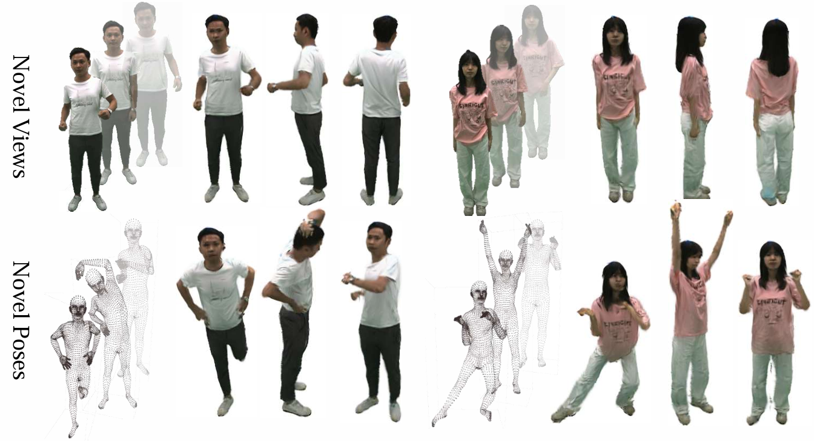

## Human-Gaussian Graph Model (HGG, ICCV 2025)

This is the official implementation of *HGG: Learning Efficient and Generalizable Human Representation with Human Gaussian Model*.

### [Project Page]() | [Arxiv]() | [Video]() 




### News
[2025.7] We released the codebase for HGG! Training code and inference code are available.


### Install

```bash
pip install torch==2.1.0 torchvision==0.16.0 torchaudio==2.1.0 --index-url https://download.pytorch.org/whl/cu118
pip install triton=2.1.0
pip install -U xformers --index-url https://download.pytorch.org/whl/cu118

git clone --recursive https://github.com/ashawkey/diff-gaussian-rasterization
pip install ./diff-gaussian-rasterization

pip install git+https://github.com/NVlabs/nvdiffrast

# LGM requirements
pip install -r requirements.txt 

# more dependencies
pip install numpy==1.26.4
pip install torch_cluster
pip install smplx
pip install git+https://github.com/facebookresearch/pytorch3d.git@stable
```

### Dataset and SMPL

Our training dataset can be downloaded from [MvHumanNet Repo](https://github.com/GAP-LAB-CUHK-SZ/MVHumanNet/blob/main/download_tool_mvhuman.py)

Please link (because the dataset is really huge) the downloaded dataset to `./mvhuman_24`, you can run the following command to prepare the dataset:


Please download the NEUTRAL pkl from [SMPL](https://smpl.is.tue.mpg.de/) model and put it as `./smpl_renderer/mvhuman_tools/visual_smpl/smpl_/SMPL_NEUTRAL.pkl` .

Then prepare the connectivity of SMPL mesh:
```bash
python vertex_connectivity.py # first get the connectivity of the mesh, you will get a pt file
```

### Inference

First, copy all the data that you want to test into ./test_dataset, like ./test_dataset/200151

Then, run the following command to test the model.

```bash
bash eval_mvhuman.sh 
```
You will get a workspace with rendered images.

### Training

First please list all the data and cameras and poses you want to train into `./mvhuman_24/human.json` like:

```json
{
    "human_id": [ "100001", "100002", "etc"],
    "view_id_list": [ "22236222",  "22236234",  "22236236", "etc" ],
    "pose_id_list": [ "0005", "0055", "0105", "etc"]
        
}
```
Then you can run the training script:

```bash
bash train.sh # modify the gpu1/8.yaml
```
You might also want to modify the `gpu1/8.yaml` file to set the training parameters, to use multi-gpu training.

### Acknowledgement
This work is generously supported by [Tencent](https://www.tencent.com/en-us/).

This work is built on the amzing work of [LGM](https://github.com/3DTopia/LGM) and [MvHumanNet](https://github.com/GAP-LAB-CUHK-SZ/MVHumanNet). We thank them for sharing the wonderful code and dataset!


### Citation
If you find this code useful in your work, please consider citing our paper (and maybe give a star to this repo!):
```
Let's wait for the camera ready version.
```

### Possible Issues and Solutions
1. When building the diff-gaussian-rasterization library, you may encounter the following error:
    ```
    The detected CUDA version (12.5) mismatches the version that was used to compile
       PyTorch (11.8). Please make sure to use the same CUDA versions.
    ```
    You might want to use this command to get to the correct CUDA version that we installed in previous steps:
    ```bash
    export CUDA_HOME=/usr/local/cuda-11.8
    ```

2. `CUDA out of memory, trying to allocate 133792483MiB...` in diff-gaussian-rasterization

   This is a known issue in the diff-gaussian-rasterization library. Please refer to the [github issue](https://github.com/ashawkey/diff-gaussian-rasterization/issues/27)